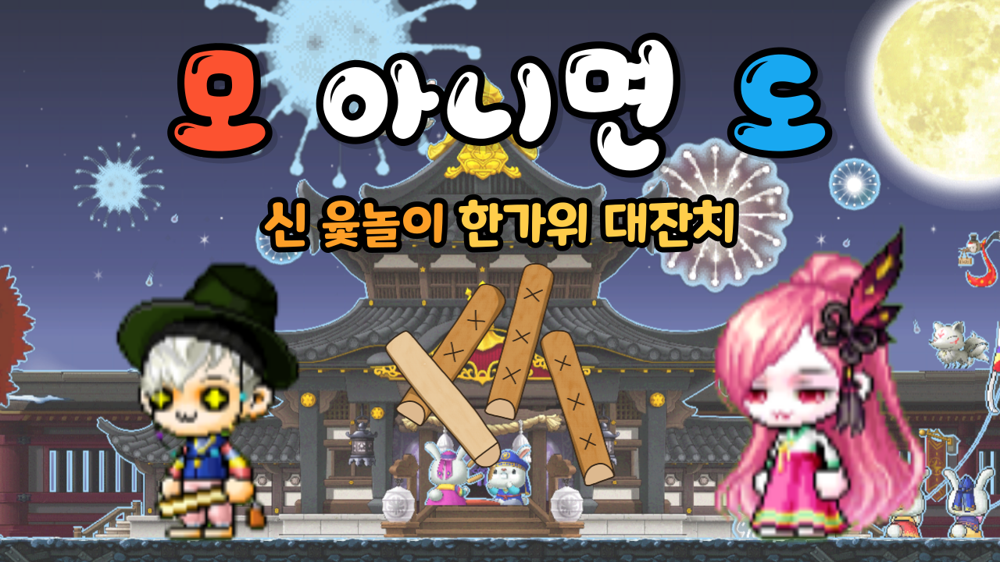

# Project
### 모아니면도(신윷놀이 한가위 대잔치), 게임 기획 및 개발

# Intro 
### 주최
넥슨 MSW(구-MOD) 서포터즈 해커톤

### 👥 Team member 
  * 한양대 ERICA, 김윤성
  * 한양대 ERICA, 정윤성
  * 동국대        이여원
  * 동국대        오민영

### 🗓️ Date 
Project term : 2022.06.30 ~ 2022.08.26  
Presentation Date : 2022.09.03  

# 게임 썸네일

### 게임 소개
- 1vs1 모드와 2vs2 모드를 선택하여 즐길 수 있습니다.
- 신윷놀이 한가위 대찬치 게임은 윷놀이 게임으로 다양한 추석 전통놀이 미니게임들과 함께 즐길 수 있는 게임입니다.
- 플레이어의 윷놀이 말이 결승선에 통과할 시 플레이어는 3점의 점수를 얻습니다.
- 보드판에 있는 각 특정칸마다 송편많이 먹기, 제기차기, 투호 등의 미니게임을 즐길 수 있으며 미니게임에서 승리시 점수를 각 1점씩 얻습니다.
- 플레이어는 윷놀이를 하며 말 3마리를 가장 먼저 완주하는 팀이 나올 시 게임이 종료됩니다.
- 게임이 종료된 시점을 기준으로 점수를 합산하여 점수가 많은 팀이 이기게 됩니다.
- 게임이 끝난 후 패자는 벌칙 룰렛을 돌려 벌칙을 수행해야합니다.
- 플레이어는 전통 놀이들과 윷놀이를 메이플 에셋들로 꾸며진 테마를 즐기며 재미를 느낄 수 있습니다.

# 게임화면

### 기획 동기
명절 날 모이기 힘들어진 요즘, 추석이면 즐기곤 했던 윷놀이가 점점 잊혀지고 있다고 생각이 들었습니다. 윷놀이 뿐만 아니라 추석 날 즐겼던 전통놀이들을 게임으로 만들 수 있다면 명절날 우리가 잊고 있었던 전통놀이들을 조금 더 쉽고 조금 더 재밌게 즐길 수 있을 것 같다고 생각해 이렇게 게임을 구상하게 되었습니다. 

### 타겟군
- 청소년층
  - 재미있는 게임 컨텐츠로 청소년들에게 쉽게 윷놀이와 전통놀이에 대한 경험을 제공합니다.
- 명절 날 가족들과 함께 즐기기 원하는 사람들
  - 명절 날 가족들과 윷놀이 게임을 통해 재미있는 추억을 쌓을 수 있습니다. 더불어 온라인으로 명절날 만나지 못한 가족들과도 함께 게임을 즐길 수 있습니다.

### 차별성
- 기존 윷놀이 규칙에 재미있는 요소들을 추가
  - 미니 게임 : 윷놀이 판에서 코너에 걸리면 미니게임을 진행함
  - 오프라인 미션 : 게임에서 진 팀 설거지 하기, 장기 자랑하기 등 가족들과 명절에 즐거운 추억을 만들어 줄 수 있는 오프라인 미션
- 명절 전통놀이를 즐기게 해주는 온라인 교육컨텐츠
  - '게임'이라는 매체를 통해 가족들과 명절 때 잘 하지 못했던 전통놀이를 메이플 게임으로 쉽게 접근하여 즐길 수 있다는 점이 가장 큰 매력입니다.
